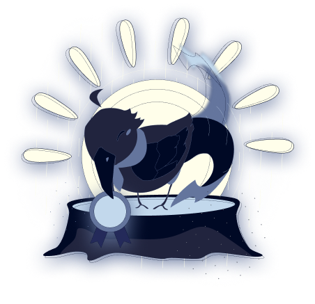

# raven-api 🚧
"RAVEN API service" for web3 users validator, cache and DB synchronizer.

Main features:
- Validate & check: verify user web3 signature legitimacy.
- Caching: caching back-end queries Web3 user status.
- Data source: RAVEN's web2 (Centralized) data source for web3 smart contract.

> NOTICE: Project under construction.

## DEVELOP

### Install deps
```shell
$ deno cache ./deps.ts
```
### test
```shell
$ deno test --allow-net --allow-env
```
### Watch && develop run
```shell
$ deno run -A --watch main.ts
```

### sync PostgreSQL DB table
Don't remember create the database.
```shell
$ deno task db:sync
```
